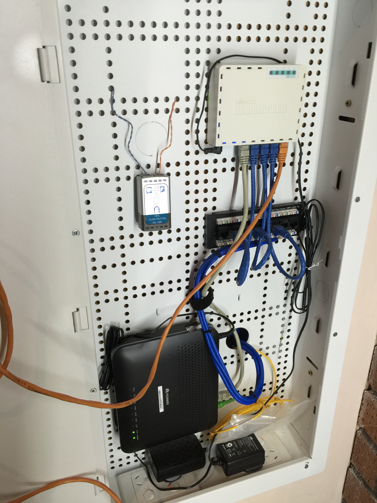
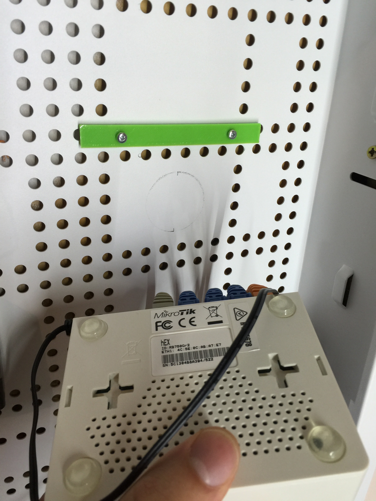

# Dynamix 2804v2 Mounts

This repository contains a number of parts which assist with mounting equipment to the [Dynamix HWS-* style cabinets]([http://www.dynamix.co.nz/home/netwbs/shw100/HWS-2804V2](https://www.dynamix.co.nz/78245)).

## Motivation

I like to keep my networking gear tidy. This enclosure is a good one but there is no easy way to mount equipment which slots on to screw heads.

## Parts Required

- M3 bolts and nuts for mounting as required, length depends on equipment being mounted. M3x6 is useful.

## Instructions

These parts are relatively simple to use, simply print them out and they should pressure fit into the back of the cabinet.

### hEX Mount

This is designed for the [RouterBoard hEX RB750Gr2](http://routerboard.com/RB750Gr2) router.

### Huwei HG8240 Mount

This is designed for the Fibre GPON installed by Enable in Christchurch, New Zealand.

## Contributing

1. Fork it
2. Create your feature branch (`git checkout -b my-new-feature`)
3. Commit your changes (`git commit -am 'Add some feature'`)
4. Push to the branch (`git push origin my-new-feature`)
5. Create new Pull Request

## License

Released under the MIT license.

Copyright, 2016, by [Samuel G. D. Williams](http://www.codeotaku.com/samuel-williams).

Permission is hereby granted, free of charge, to any person obtaining a copy of this software and associated documentation files (the "Software"), to deal in the Software without restriction, including without limitation the rights to use, copy, modify, merge, publish, distribute, sublicense, and/or sell copies of the Software, and to permit persons to whom the Software is furnished to do so, subject to the following conditions:

The above copyright notice and this permission notice shall be included in all copies or substantial portions of the Software.

THE SOFTWARE IS PROVIDED "AS IS", WITHOUT WARRANTY OF ANY KIND, EXPRESS OR IMPLIED, INCLUDING BUT NOT LIMITED TO THE WARRANTIES OF MERCHANTABILITY, FITNESS FOR A PARTICULAR PURPOSE AND NONINFRINGEMENT. IN NO EVENT SHALL THE AUTHORS OR COPYRIGHT HOLDERS BE LIABLE FOR ANY CLAIM, DAMAGES OR OTHER LIABILITY, WHETHER IN AN ACTION OF CONTRACT, TORT OR OTHERWISE, ARISING FROM, OUT OF OR IN CONNECTION WITH THE SOFTWARE OR THE USE OR OTHER DEALINGS IN THE SOFTWARE.
